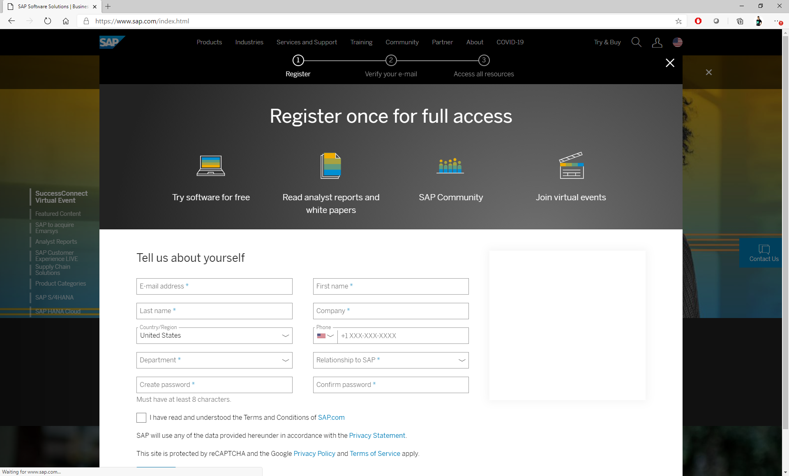

# Registration

[Gardener](https://gardener.cloud/) is an open source project that offers a solution for centralized and simplified manamgenet of Kubernetes environments that spread across different IaaS providers and private clouds.

For the **SAP TechEd Workshop DEV269** that is part of the [virtual SAP TechEd 2020](https://events.sap.com/teched-global/en/home) we offer a trial Gardener environment that will be available to the TechEd participants to experience the capabilities of the Gardener open source solution using the exercise guidelines of the workshop.

If you want to complete the exercises of the SAP TechEd DEV269 workshop, you need to have a registration on www.sap.com. If you have your www.sap.com user already available, you can proceed directly to the exercises.

To create a new user [REGISTER](https://www.sap.com/registration/trial.908cb719-0e03-421c-a091-daca045f0acc.html) on www.sap.com.

 

After completing the registration you will be able to proceed with the workshop exercises.

Continue to - [Exercise 1 - Gardener](../ex1_beginners/01_dashboard.md)

