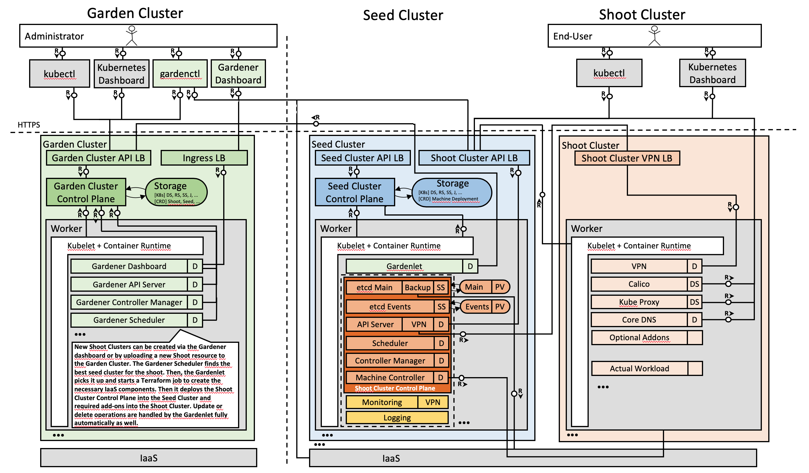
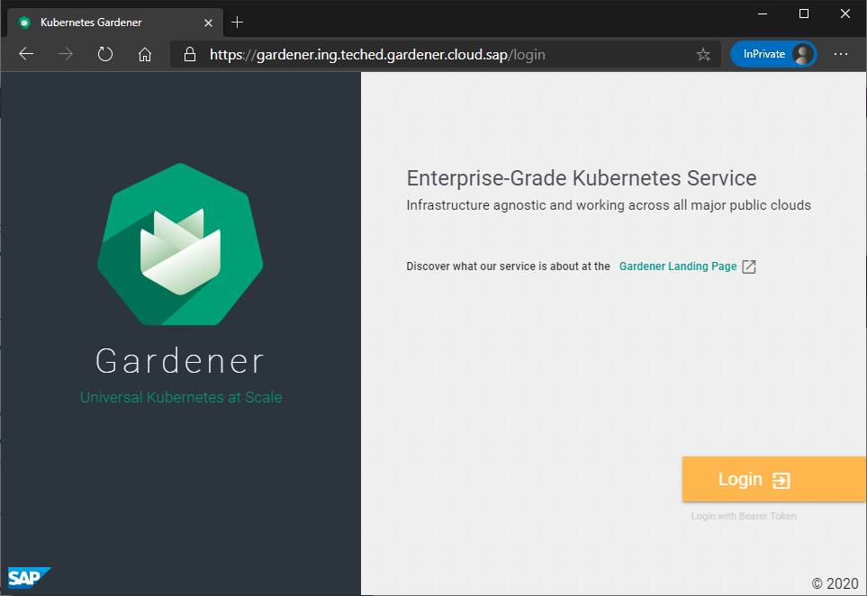
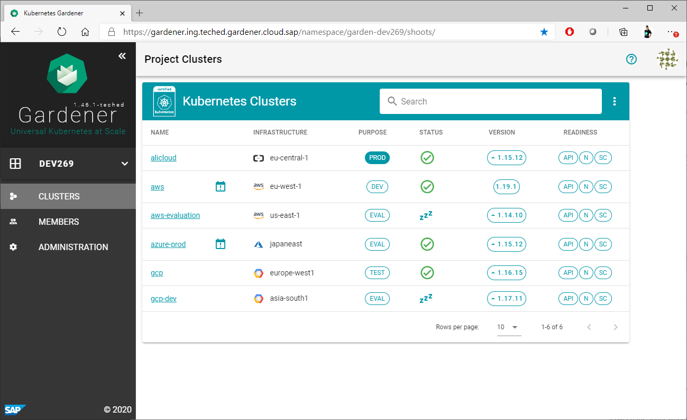

# Exercise 1 - Getting to know Gardener

[Gardener](https://kubernetes.io/blog/2018/05/17/gardener/) is an open source project that offers Kubernetes consumers to centralize and operate efficiently homogenous Kubernetes clusters across different IaaS providers and even private environments. This way the same cloud-based application version can be hosted and operated by its vendor or consumer on a variety of infrastructures. When there is a demand for a new infrastructure provider coming from a new customer or from your development team, Gardener helps you to quickly and easily on-board your workload also on this new infrastructure by keeping the seamless Kubernetes management experience for your Kubernetes operators while upholding the consistency of the CI/CD pipeline of your software development team.

Gardener is based on the idea of three types of clusters – Garden cluster, Seed cluster and Shoot cluster, see the Gardener Architecture diagram below. The Garden cluster is used to control the entire Kubernetes environment centrally. The highly available seed clusters are used to host the end users (shoot) clusters’ control planes. Finally, the shoot clusters consist only of worker nodes to host the cloud native applications.

 

Exercises provided with the workshop `DEV269` will guide you to experience administrative and operational activities with Gardener shoot clusters.

If you want to experience the admninistration and operation of the entire Gardener landscape setup, including management for Garden cluster and Seed clusters, you can simply leverage the Gardener open source project available on https://github.com/gardener.

## Exercise 1.1 Navigate into Gardener Dashboard

[Gardener Dashboard](https://github.com/gardener/dashboard) is a web based UI that helps to easily operate your Gardener managed Kubernetes environment. With Gardener dashboard you get an excellent status overview of your entire Kubernetes landscape that can spread across many different infrastructure providers.

1. Click the link to get to the login page of the Gardener dashboard:

    [https://gardener.ing.teched.gardener.cloud.sap/login](https://gardener.ing.teched.gardener.cloud.sap/login)

2. Click the button "Login"
 

3. To login use the user and password details that you have from your www.sap.com registration. A successful login will bring you into the Gardener dashboard application. See the screenshot below:
 

## Up next
In the [next exercise](./02_project_clusters.md), you will learn how Gardener organizes and visualizes clusters.

