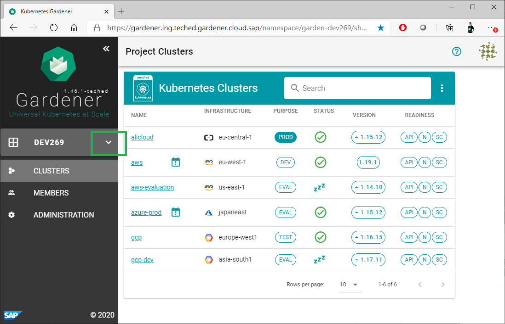
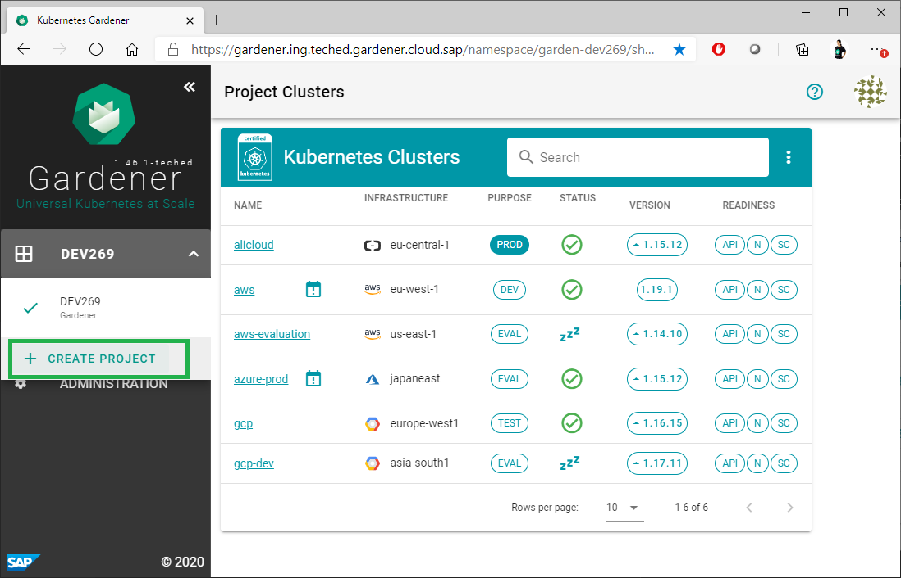
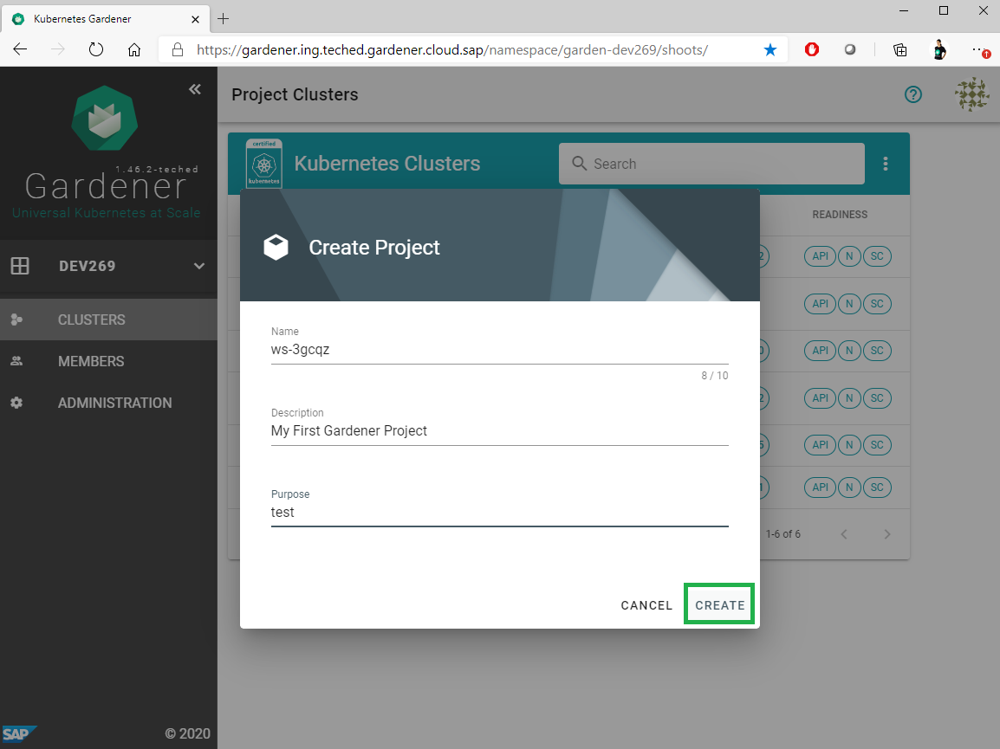
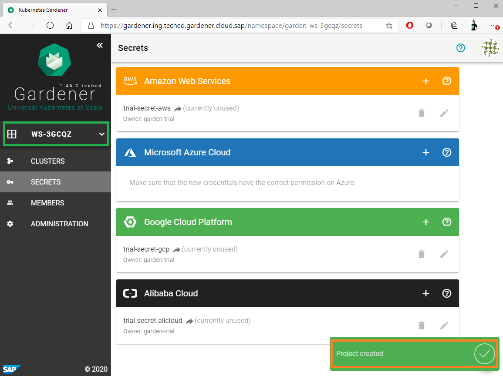

# Exercise 1.2 Create your first Gardener Project

Gardener project is one of the main Gardener resources. It is used to group Gardener managed Kubernetes clusters (shoot clusters) for common administative activities like, for example, members management, provider secrets configuration, etc.

When using Gardener, Kuberentes clusters are always created as associated to a concrete Gardener project.

1. Navigate to the menu on the left and click the button to open the drop down with the Gardener projects:
 

2. Click "CREATE PROJECT"
 

3. Configure project details. You can use the random generated project name or simply provide another unique name for your new project. Provide also a description and the purpose and click "Create".
   

4. Once you are ready, you will have your first Gardener project already created and you will be able to see it in the menu on the left.
 

## Up next
In the [next exercise](../ex1_beginners/03_project_clusters.md), you will learn what details are available in the Gardener dashboard for the project clusters.

