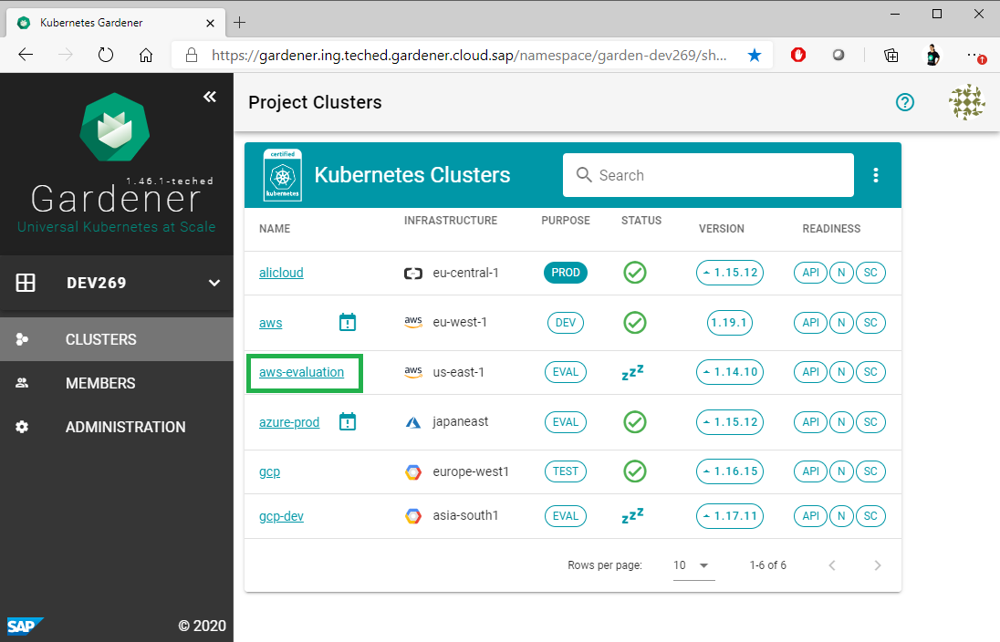
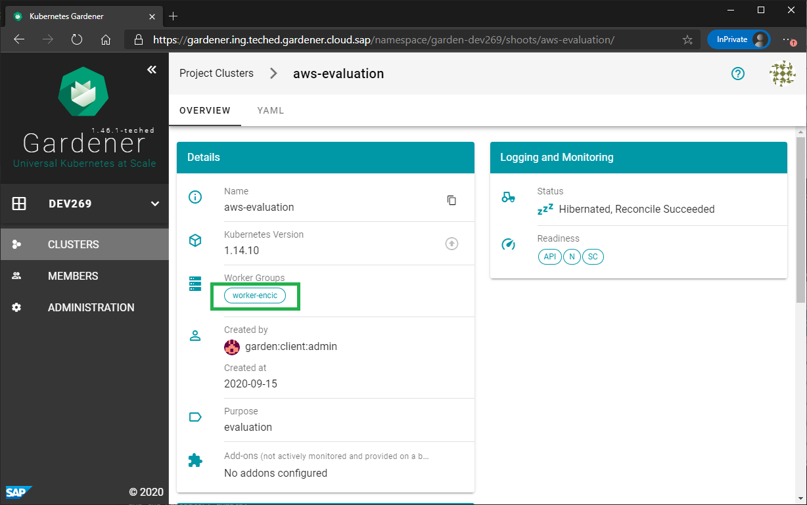
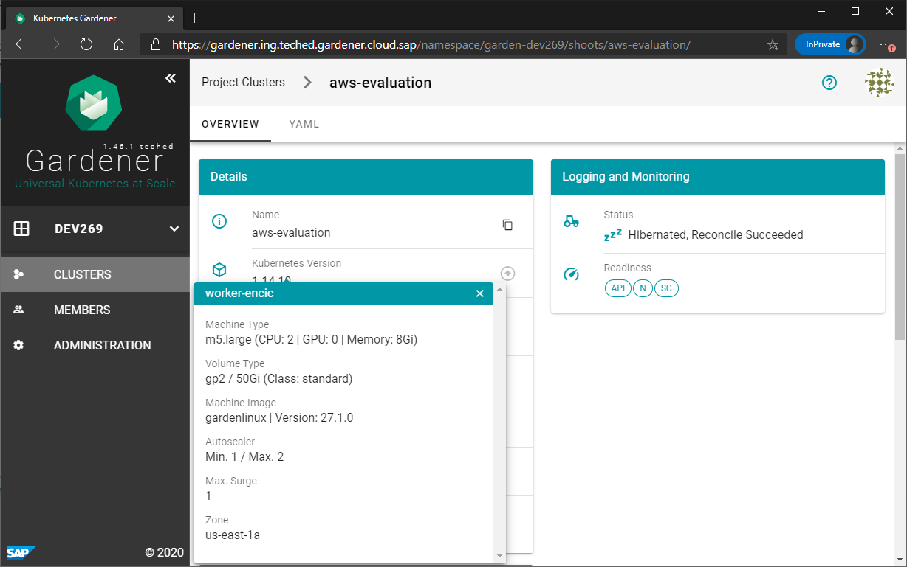

# Exercise 1.3 Cluster overview

You can find more details about the clusters when using the overview of a single cluster.

1. While you are on the view with the Project Clusters for the project `DEV269`, select one of the clusters by clicking on the cluster name to navigate to the overview page of this cluster.
 

2. On the overview page you will find the information organized in different tiles. Navigate to the "Details" tile and click on the worker group.
 

3. A pop-up will appear with the worker node details for this worker group. These are the parameters that are used by Gardener when managing the worker nodes for that cluster. You will learn how to configure the worker nodes for a cluster in the next section with exercises offered for this workshop.
 

## Summary

- You have now successfully created your fist Gardener project
- You also learned what details are available about the clusters for a project member with viewer permissions and how to find these details.

## Up next
In the [next exercise](../ex2_advanced_ui/01_create_project.md), you will learn how to create and manage Gardener shoot clusters in your own project.

