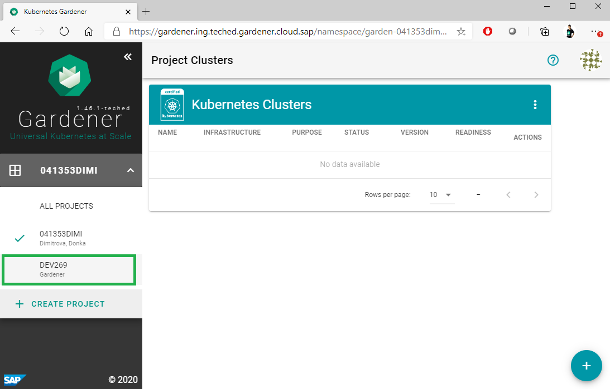
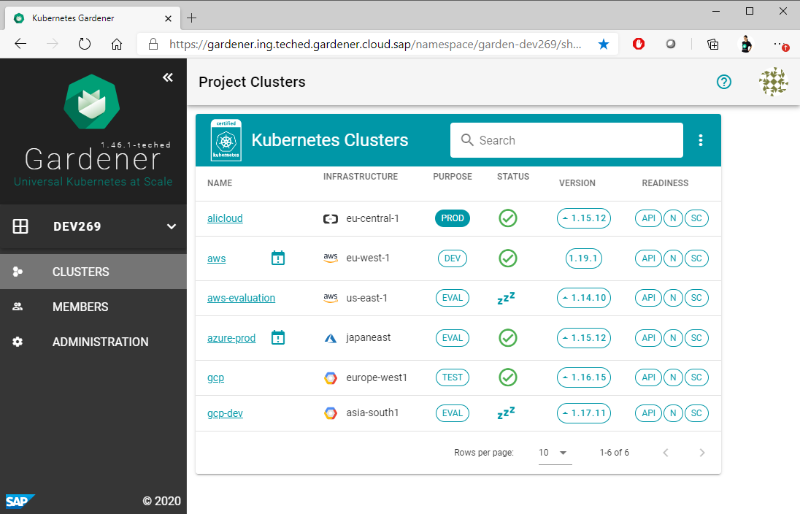
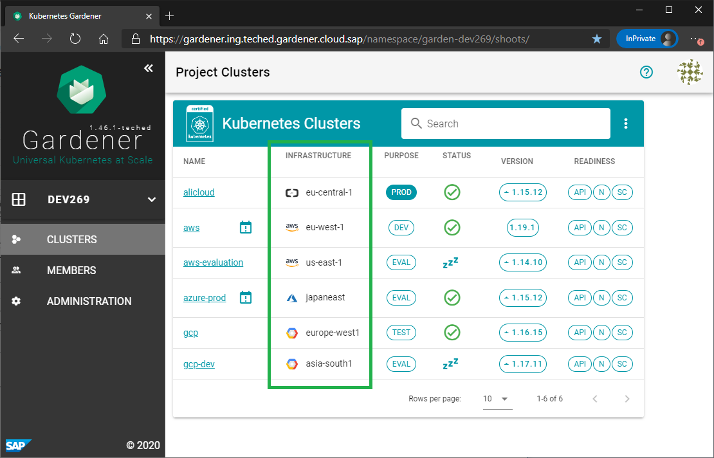
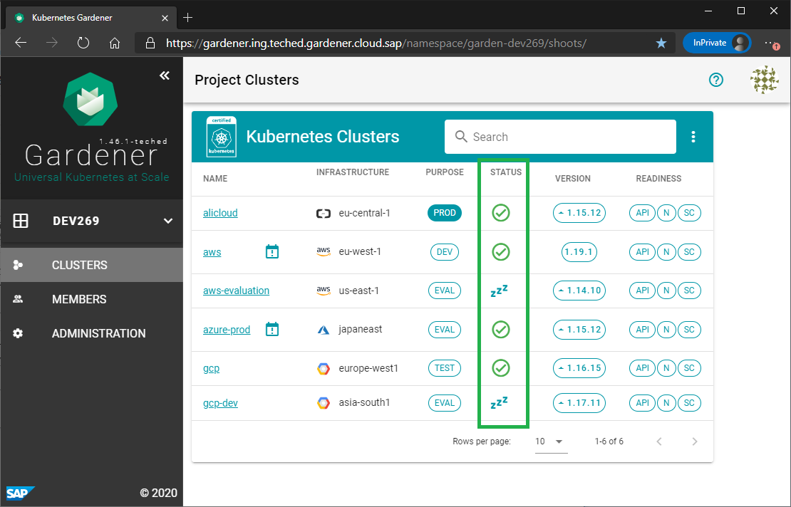
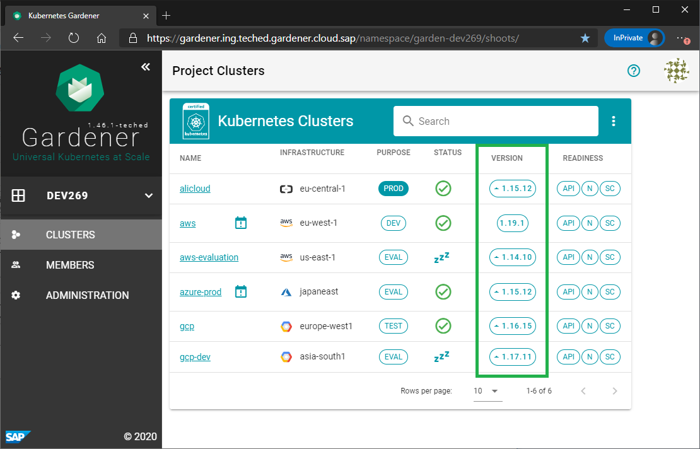
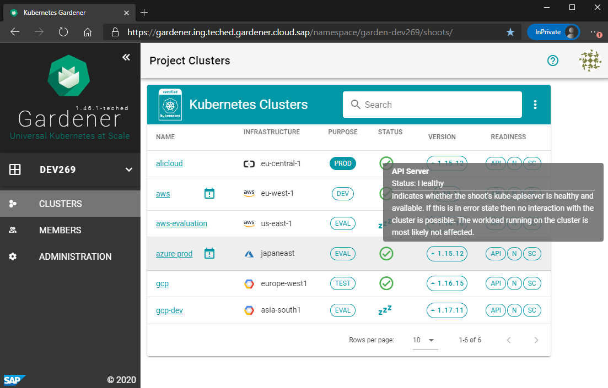

# Exercise 1.3 Project Clusters

As an operator for a Gardener managed Kubernetes landscape, you could be granted with viewer access for a Gardener project to monitor the status of the Kuberentes clusters.

In this exercise you will experience what a Gardener project member can do when he/she is grated with viewer permissions for a project.

For the purpose of this exercise, all workshop participants are granted with viewer permissions for a project with the name `DEV269`. This project has been created in advance together with all clusters that belong to it.

>NOTE: If you want to experience directly the creation and management of Gardener clusters, you can jump to the [next section](../ex2_advanced_ui/01_cluster_setup_ui.md) of this workshop.

1. Navigate to the Gardener project with name `DEV269` using the project drop down list from the menu on the left:
 

2. On the right side, in the Project Clusters view you can see the list with project clusters that belong to the Gardener project `DEV269`.
 

3. Look at the infrastructure details of these clusters. You will find that they are created using different infrastructure providers. Try to find the clusters in the list that are created using different regions of one and the same infrastructure provider.
 

4. You can use one and the same project to create Kubernetes clusters for different purposes, like for example, you can have test and productive clusters within your project.
  Check out the "Purpose" column and try to find the cluster marked as production (`PROD`).
 

5. The Status column in the dashboard shows if the cluster is alive or hybernated at the moment. Hover with the mouse pointer over the icons to display the description. Try to find at least one hybernated cluster in the project `DEV269`.
 

6. Gardener managed clusters can be created using a Kubernetes version of your choice. Try to find the cluster from project `DEV269` that is created using the latest Kubernetes version.
 

7. Gardener dashboard offers also details on the readiness of the cluster components. Hover with the mouse pointer over the icons of the components in the "Readiness" column to check the messages about the component readiness.
 

## Up next
In the [next exercise](../ex1_beginners/04_cluster_overview.md), you will learn how to find more details about Gardener shoot clusters.

