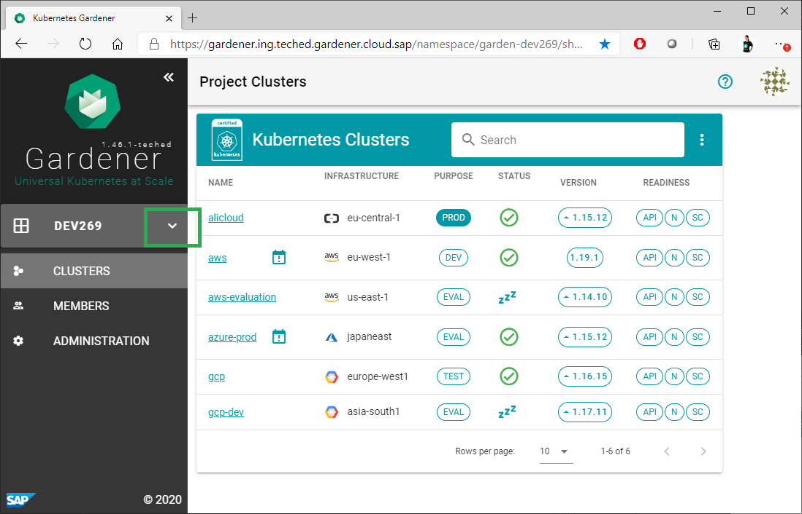
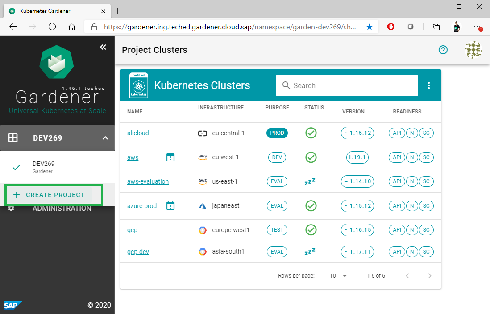
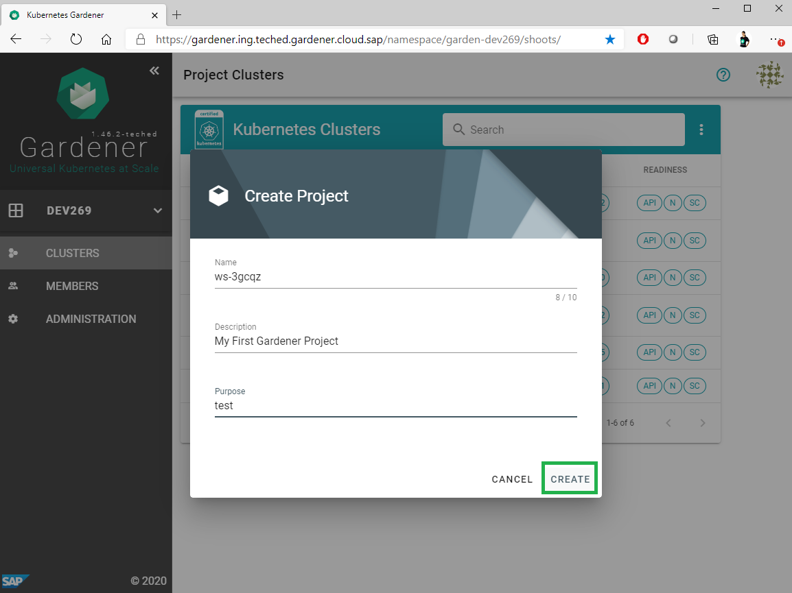
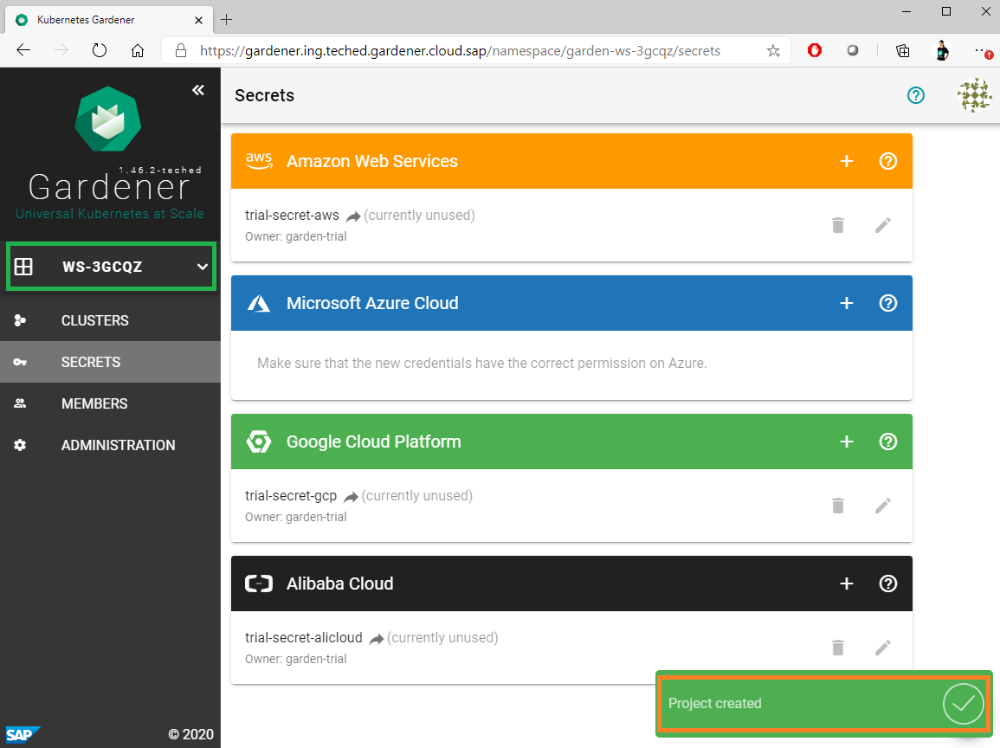

# Exercise 2.1 Create your first Gardener Project

The project you looked at in exercise 1 was read-only to you. Now, you will create your own Gardener project, which will serve as the context for the following exercises.

1. Navigate to the menu on the left and click the button to open the drop down with the Gardener projects:
 

2. Click "CREATE PROJECT"
 

3. Configure project details. You can use the random generated project name or simply provide another unique name for your new project. Provide also a description and the purpose and click "Create".
   

4. Once you are ready, you will have your first Gardener project already created and you will be able to see it in the menu on the left.
 

## Up next
In the [next exercise](./02_cluster_setup_ui.md), you will create a cluster in the context of this project.

