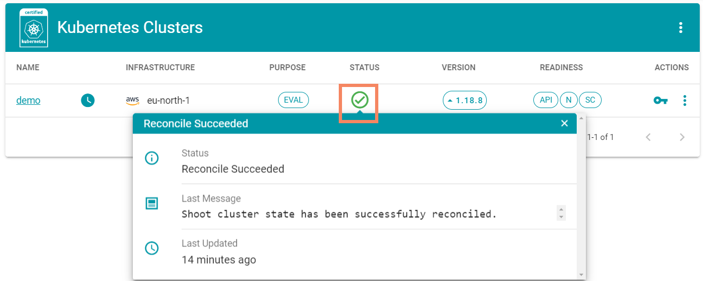

# Exercise 2.2 - Cluster Lifecycle Operations

## Prerequisites
You successfully completed exercise 2.1, where you created a cluster. This exercise will continue to work with this cluster, therefore it should be running.

Note, that you can always click the status icon to get more details about currently running reconcile operations.

<br>

## Available lifecycle operations
Via the Gardener dashboard, navigate to your cluster's details and scroll down to the "Lifecycle" section. This exercise will discuss a few of those.

<br>


## Hibernation
Gardener allows you to hibernate a cluster when you don't need it. Firstly, verfiy that the cluster is up and running but querying the nodes.

```bash
kubectl get nodes
```

Next, give it a try and hit the "Pause" button to send the cluster into hibernation.

<br>

Once reconciled all nodes will be removed and even the API server is not available. You may try to connect, but be prepared to wait for the timeout.

To bring the cluster back up, click the "Play" button where the "Pause" was previously. Watch the reconcilation status until the cluster is up again and try to query the nodes again. Note, that the node names and age have changed. The backing VMs have been newly created during wake up.

## Hibernation schedule
While you can do this manually, it is more likely that you would want to schedule hibernation.

To configure and adapt the default schedule, click the cogwheel next to hibernation in the lifecycle section. The screenshot below suggests a few values, but feel free to enter custom values.

<br>

## Kubeconfig rotation
If you completed the previous steps, you have proven multiple times, that you own valid credentials to talk to the API server. Now, you might face a situation where you want to invalidate these, e.g. someone uploaded their credentials to a public github repository.  This is where the kubeconfig rotation comes in handy. Give it a try and hit the "rotate" button.

<br>

After successful reconcilation, try to connect with your now outdated credentials by querying pods in the kube-system namespace.

```bash
kubectl get pods -n kube-system
```

You will get an error message saying that you are unauthorized. Download the new kubeconfig from the Gardener dashboard to regain access.

## Cluster update
Another lifecycle operation is a Kubernetes version update. To begin, let's check current version of the API server and the kubelets running on the nodes.

```bash
# Check server version
kubectl version

# Check kubelet version
kubectl get nodes -o custom-columns=NAME:.metadata.name,VERSION:.status.nodeInfo.kubeletVersion
```

Following the instructions of the previous exercise, you created this cluster based on an earlier version of Kubernetes and now it is time to change that. You can access the cluster update dialog either from the overview page by clicking on the version or via the details view. Now, select the latest of the available versions and enter the cluster's name to start the update.

<br>

As usual you can observe the progress via the status information for your cluster. Once the operation has been completed, you can check the versions again.

## Summary

- You have learned about cluster hibernation and how to save money by setting up a hibernation schedule for non-productive clusters
- You have rotated the kubeconfig credentials of your cluster
- You have updated the Kubernetes version of your cluster

## Up next
In the [next exercise](./03_deploy_sample_addon.md), you will deploy a demo application into your cluster
