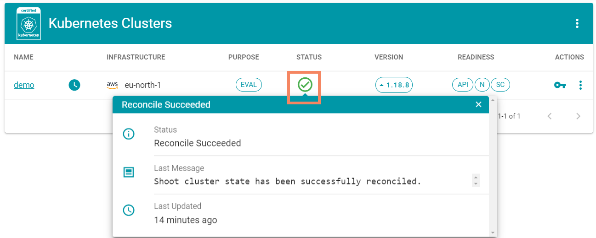
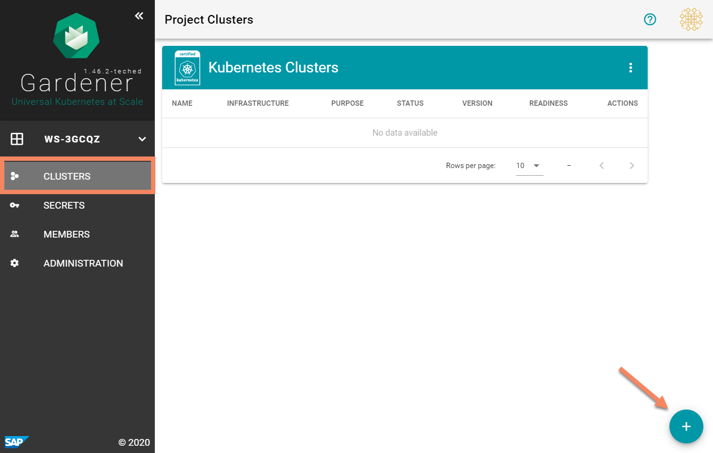
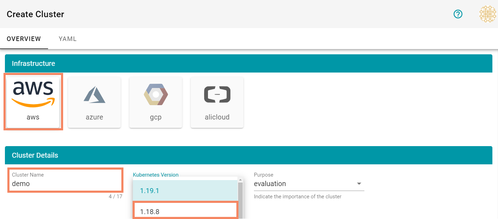
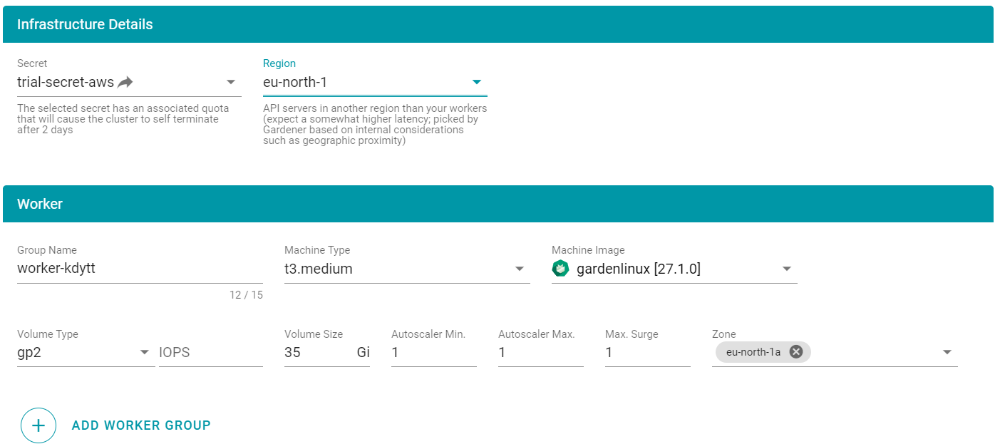
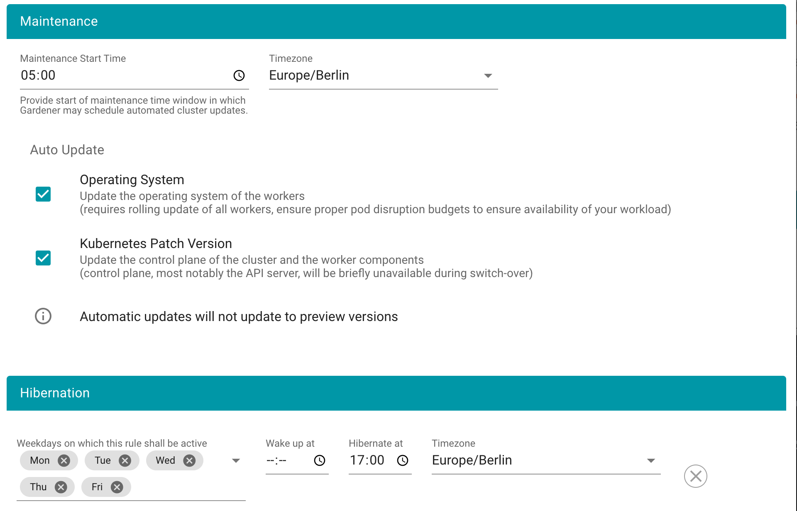
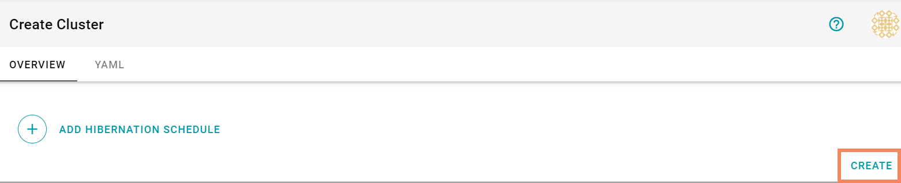
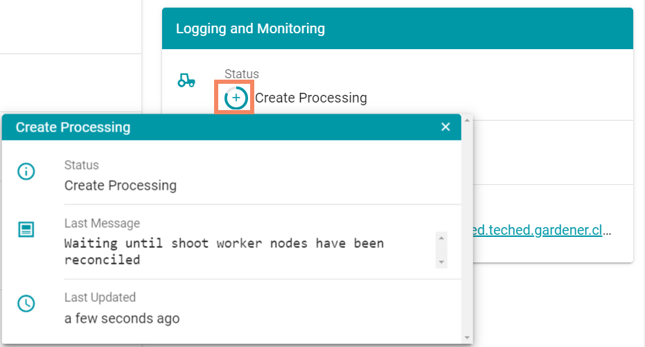
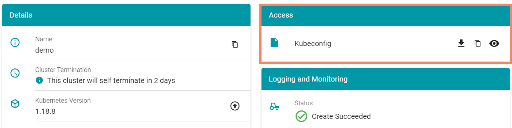

# Exercise 2.2 - Create your first cluster using the Gardener Dashboard

## Prerequisites
You have successfully created a Gardener project that was automatically provisioned with trial secrets for various infrastructures. Additionally, you need a [kubectl binary](https://kubernetes.io/docs/tasks/tools/install-kubectl/) to access the cluster you are going to create.

To start this exercise, open the Gardener dashboard and navigate to your project.

Note, that you can always click the status icon to get more details about currently running reconcile operations.

<br>

## Configure the cluster parameters
The starting point for this exercise is the **clusters** view within the Gardener dashboard. The displayed list should be empty, meaning there are no clusters in your project right now.

To add a new cluster to your project, click the :heavy_plus_sign: button in the lower right corner. This will bring up the "create cluster" dialog. Here you can configure how the cluster should look like and send this request to Gardener for processing.

<br>

### Choose cloud provider and cluster version
Firstly, choose in which cloud provider enviorment you want to create your cluster. You can use the default - AWS - or choose any provider for which a secret has been configured.

**Note: This example and the screenshots will assume AWS has been chosen**

The next decision is about the cluster's name, Kubernetes version and purpose. While you can use any cluster name accepted by the input field, please select the latest version of Kubernetes 1.18 from the list (i.e. 1.18.8). Upgrading to the latest major version is part of a subsequent exercise. As for the purpose of the cluster, you go can go with the default "evaluation".

**Note: Testing clusters do not get a monitoring or a logging stack as part of their control planes**

<br>

### Infrastructure Details and Worker
Up next is the selection of infrastructure-specific credentials. In productive scenario, you can configure multiple credentials to create clusters in different accounts of the same infrastructure. In this scenario please use the preconfigured trial secret.
As part of the same section, you can also choose a region for your cluster's shoot resources to be deployed to. The region is dependent on the infrastructure and of course the account linked via the secret has to have sufficent quotas in this region.

Below the infrastructure details you can configure the cluster's initial compute power. A shoot can have one or several groups of workers, where each is configured with its own parameters. For this exercise, you have to configure one group of workers using  the default settings. Each worker of this group will be running with the suggested version of [Garden Linux](https://github.com/gardenlinux/gardenlinux).

<br>

### Add-Ons
Right now, there is no need to deploy any add-on. You can leave this section to its default values.

### Maintenance and Hibernation
Gardener can perform certain maintenance tasks automatically. In this section you can specify the start of your maintenance window as well as the tasks. Please select time and time zone according to your preferences.

Finally, you can configure a hibernation schedule. When hibernated, neither the nodes nor the control plane will be available. Configure the cluster to hibernate at 05:00 PM and adapt the time zone, if necessary.

<br>

### Create the cluster
The steps above conclude the relevant configuration options for now. Go ahead, click the "create" button in the right lower corner to create the cluster.

<br>

It takes some time for the procedures to complete. You can check the progress by clicking the :heavy_plus_sign: in the "Logging and Monitoring" section of the cluster details screen. The same information is also accessible via the cluster overview - there again click the :heavy_plus_sign: in the "Status" column.

<br>

In the meantime you could also take a look at the [Gardener Architecture Overview](https://gardener.cloud/documentation/concepts/architecture/) to learn more about the thing happening in the background.

## Explore the cluster
Once the cluster has been created, go back to the clusters page to start with the next section.

### Download kubeconfig
In order to access the cluster you need a valid kubeconfig file. To obtain it you can either click the key icon on the cluster overview or navigate to the cluster's details page and access it there. Download and store the kubeconfig in an appropriate format and location.

<br>

>NOTE: With the downloaded kubeconfig you only have the permission to read and delete resources in your cluster. You can't create or update resources (like deployments). This restriction only applies for this workshop.*

Next, verify that you can connect to the cluster:

```bash
kubectl version
```
The `Server Version` should match the value you selected earlier.

### Nodes
Now take a look at the node(s):

```bash
# list nodes, check the version & role
kubectl get nodes -o wide

# get node details
kubectl describe node <insert-node-name>
```

The cluster was created with the minium number of nodes configured for each worker group. Note, that there is no role such as `control-plane` or `master` assigned to any node. All control plane components are hosted in the seed cluster.

### Pods
Next take a look at the pods:

```bash
kubectl get pods --all-namespaces
```

Again, there are only components like `kube-proxy` or `calico-node` which are required to run on the nodes forming the networking of the shoot.

## Summary

- You have created a gardener-managed Kubernetes cluster
- You have explored the cluster using `kubectl`

## Up next
In the [next exercise](./03_cluster_ops.md), you will explore more Gardener capabilities with regards to cluster management.
