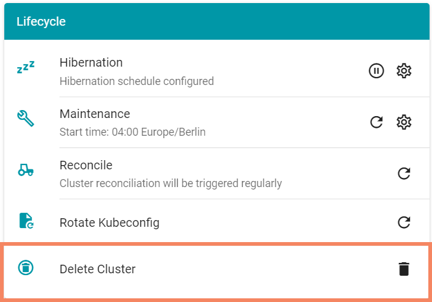

# Excercise 2.4 - Cleanup

Gardener manages the full lifecycle a Kubernetes cluster, so deletion is the final step of exercise 2.

Go to the dashboard, select your cluster and navigate to the lifecycle section.

 

Start the deletion process and follow the instructions.

Once the cluster has been removed, you have successfully completed exercise 2 - congratulations!

## Summary
- You have deleted your kubernetes cluster using the gardener dashboard

## Up next
In the [next exercise](../ex3_advanced_cli/01_cluster_setup_yaml.md), you will create a new cluster and configure it by modifying the Shoot yaml that is backing the Gardener cluster
