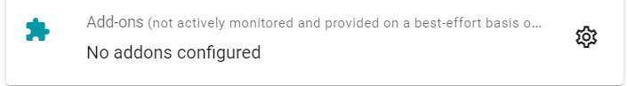
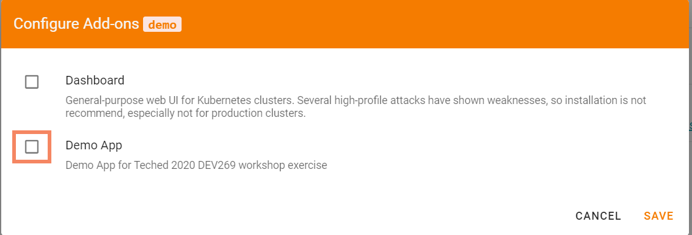
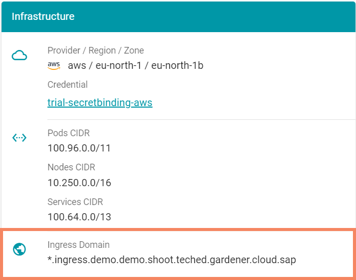

# Exercise 2.4 - Add-ons

In this exercise you will deploy an add-on to your cluster using the Gardener dashboard. Add-ons are based on helm charts and allow standardized and central configuration of components.

The Gardener version used in this context comes with a demo application bundle, that includes:
- an nginx ingress controller incl. configuration
- a demo application exposed via an ingress resource
- a default backend for the ingress controller

## Prerequisites
You have completed exercise 2.1 and the cluster is up and running.

## Deploy the demo app
Navigate to your cluster's details and locate the Add-ons section.

<br>

Click the cogwheel and activate the demo app in the upcoming dialog.

<br>

Once the cluster has been reconciled, you can move on to the next step.

**NOTE**: This is NOT the standard way of deploying applications to any Gardener managed cluster. In your own setup you will have full cluster-admin access.

## Explore the demo app
The demo add-on features a nginx ingress controller, a default backend and a small demo app, which is exposed via a regular ingress resource.

### Ingress Domain 
Firstly, check the cluster's infrastructure details (reloading the page might be required). It should feature a domain, which Gardener configured for you. 

<br>

The ingress domain points to a `LoadBalancer` service in `kube-system` namespace. Execute the following steps on a commandline to verify the setup:
```bash
# Look up address associated with the domain
nslookup <wildcard domain copied from dashboard>

# compare address with the ingress controller's LoadBalancer service
kubectl -n kube-system get service addons-nginx-ingress-controller
```

For more details about Gardener's DNS management capabilities, check the [documentation](https://gardener.cloud/documentation/concepts/networking/dns_controler_manager/).

### Demo app
Next, let's take a look a the demo application consisting of `deployment`, `service` and `ingress` resources. All of these got deployed into the `default` namespace. 
The `deployment` is a nginx webserver with a "Hello Gardener" message, which is exposed to you via the combination of the `service` and the `ingress`.

```bash
# check the deployment
kubectl get deployment

# check the service
kubectl get service

# check the ingress
kubectl get ingress
```

The best way to explore the demo app is by opening the ingress-URL in a browser. Note, that there are two hosts configured for this ingress, but you can use any of them.

### Inspect the ingress
When accessing the URL, you might notice, that it defaults to https and provides a properly signed certificate. The certificate will be issued by [Let's Encrypt](https://letsencrypt.org/) and is valid for the two hostnames you found in your ingress resource.

Next, take a look at the events concerning the ingress:

```bash
kubectl describe ingress -l app=nginx-ingress
```

While you will certainly expect the ingress controller to parse the information, there is another contoller at work - the cert-manager. It takes care of the certificate's request, its processing and finally creates the secret which holds the certificates. The trigger for the controller is "hidden" in an annotation to the ingress:

```bash
kubectl get ingress -l app=nginx-ingress
```

Take a look at the [documentation]( https://gardener.cloud/documentation/concepts/networking/cert-management/) for more details.

### Gardener Extensions
Of course, creating certificates for an ingress is no rocket science. More interestingly it is offered as a central service to the other shoot clusters. 

The basis is Gardener's extensions concept. It allows you to enable and manage "consumer" features such as the [cert-manager](https://github.com/gardener/cert-management) centrally in your Gardener installation. 
However there is another dimension to the extensions concept as it is the foundation of any cluster created by Gardener. Whether it is usage of cloud providers such as GCP or the latest version of Gardenlinux as the operating system of a node, all configuration and functionality is brought in via extensions.

As the final step of this exercise, take a look at the already [available extension repositories](https://github.com/gardener/gardener/blob/master/extensions/README.md#known-extension-implementations). 

## Summary

- You have deployed a demo app using the cluster add-ons, as for this workshop you only have limited permissions for your kubernetes cluster and do not have the permission to deploy applications, e.g. using kubectl
- You have explored the resources that were created for the demo app and verified that is running by opening the ingress-URL with your browser
- You have noticed that browser trusted certificates were automatically issued

## Up next
In the [next exercise](./05_cleanup.md), you will delete your kubernetes cluster
