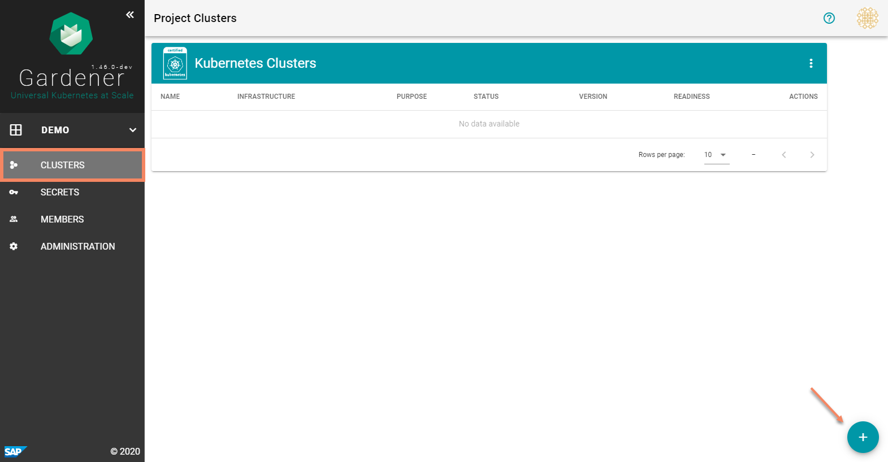
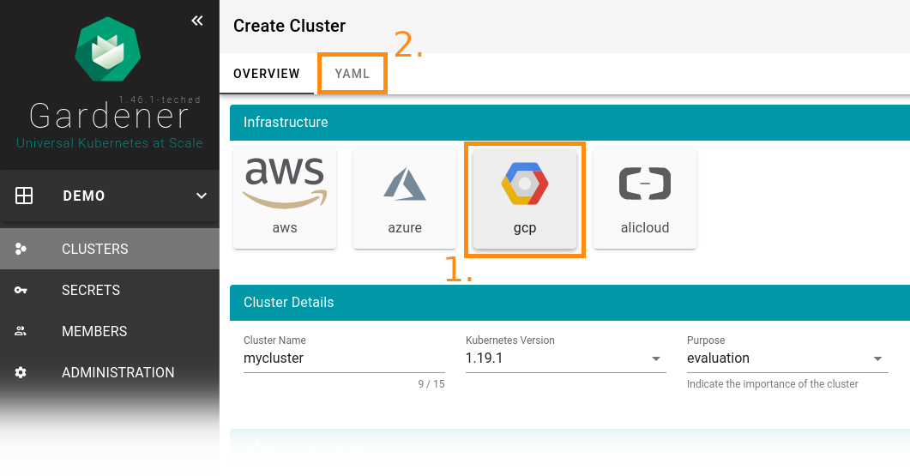
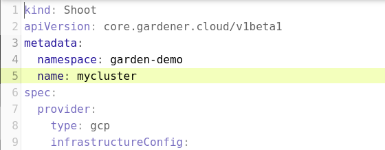
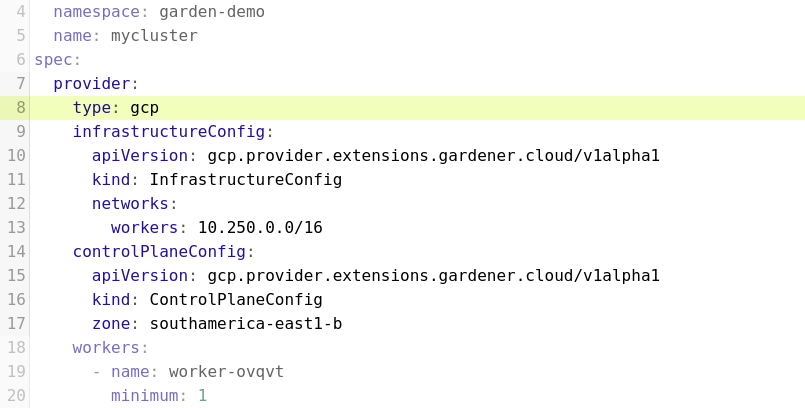
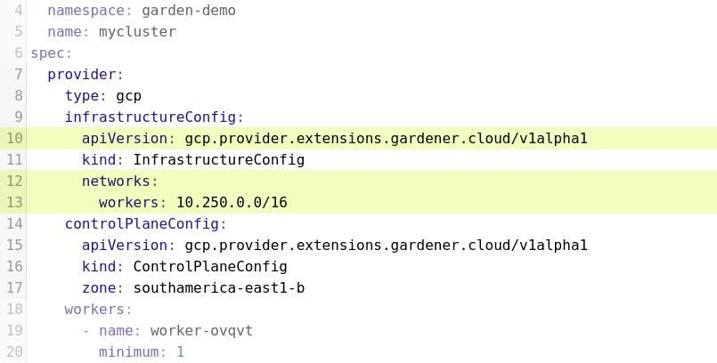
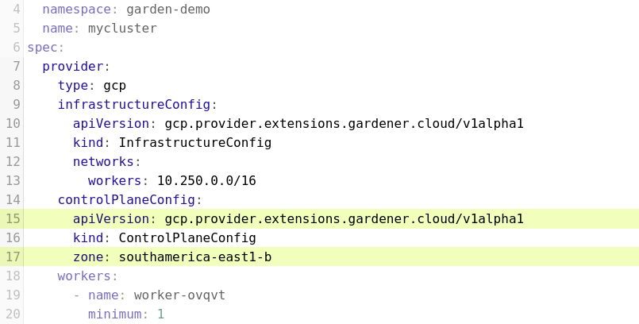
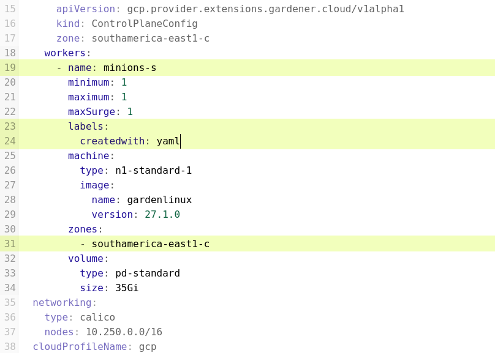
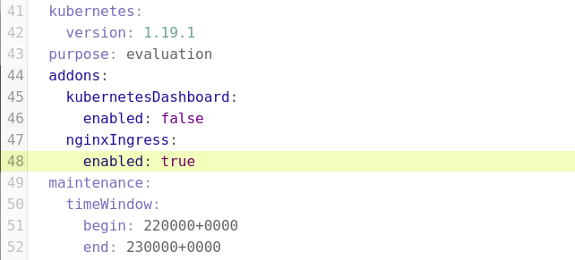
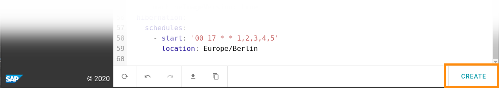

# Exercise 3.1 - Setup a shoot cluster using a YAML description

## Prerequisites

You have successfully created a Gardener project that was automatically provisioned with trial secrets for various infrastructures. Additionally, you need a [kubectl binary](https://kubernetes.io/docs/tasks/tools/install-kubectl/) to access the cluster you are going to create.

To start this exercise, open the Gardener dashboard and navigate to your project.

## Create and configure a new cluster

Again, the starting point for this exercise is the **clusters** view within the Gardener dashboard. The displayed list might still contain the cluster you created in the last exercise. Anyway, we are are going to create a new cluster now as the old one should be in the process of deletion.

To begin the configuration process, click the "+" button in the lower right corner. This will bring up the "create cluster" dialog.

 

After all, Gardener uses YAML descriptions of the clusters it is supposed to create and manage. Gardener will create a YAML template based on the selection made on the _Overview_ UI.

For this exercise, you are going to create a cluster in Google Cloud Platform (GCP), so on the _Overview_ page, click the GCP button before changing to the YAML editor.

 

The YAML shown in the editor already contains lots of meaningful values - in fact, it resembles all the settings of the graphical UI on the _Overview_ page. Hitting the __Create__ button at the bottom of the screen would result in a fully working cluster - but let's do some changes to the YAML first.

### Change the cluster name

Look into the `.metadata` section of the YAML, you will find a `name:` element. Change its value to a cluster name of your choice but no longer than seven characters.

 

### Choose GCP as provider

Have a look at the `.spec` section of the YAML. Within the `.spec` section, you will indicate all specifics of your shoot cluster. It therefore consists of several elements each describing certain aspects of the cluster.

In the `.spec.provider` element, make sure the value of field `type:` is `gcp` to have the cluster deployed to Google Cloud Platform.

 

### Set infrastructure network for the cluster

To deploy a cluster to GCP, Gardener will allocate a new VPC to your cluster which will contain one subnet. You will have to specify how this network will look like.

**Note: This setting is infrastructure specific and will look different between AWS and GCP.**

Have a look at the `.spec.provider.infrastructureConfig` element. Make sure the value of the `apiVersion:` is the proper settings for GCP which is `gcp.provider.extensions.gardener.cloud/v1alpha1`.

Another element inside `.spec.provider.infrastructureConfig` is `networks:`. This elements contains  the name of the subnet to be created as well as its address space. For this, just go with the suggested values of `workers: 10.250.0.0/16` (or change them if this has not been suggested to you).

 

### Specify the control plane settings for the cluster

The `.spec.provider.controlPlaneConfig` element contains all settings for the seed cluster that hosts your shoot cluster. This can be used to set the region where the seed cluster and thus the _api-server_, _etcd_, _controller-manager_, etc. for your shoot cluster should be located.

**Note: in this demo, the only available option is `southamerica-east1-c`, so make sure this is the value for the `zone:` element.**

 

### Configure the worker nodes

Inside the element `.spec.provider.workers` you will find the [specification of your worker nodes](https://gardener.cloud/documentation/references/extensions/#extensions.gardener.cloud/v1alpha1.WorkerSpec). Nodes are organized in pools, all nodes within a pool share the same setup but workers in different pools can have different properties.

By default, there will be one worker pool with a generated name. As Kubernetes worker nodes used to be called _Minions_ in the earlier days, change the value of the `name:` element to `minions-s`.

To be able to uniqely identify worker nodes from a certain pool, Gardener will automatically attach some labels to them. However, you can also attach your own, custom labels. Add another `label:` element and add a `key: value` combination of your choice.

The `zone:` element specifies in which GCP availability zone the worker nodes should be provisioned. **In this demo, the only valid options are `southamerica-east1-a`, `southamerica-east1-b` or `southamerica-east1-c` so make sure that one of these values is assigned.**

 

### Enable an add-on

Gardener can automatically deploy add-ons like the Kubernetes Dashboard or an NGINX ingress controller to your cluster. The add-ons are selected in the `.spec.addons` section of the YAML. Available add-ons are already listed there with their `enabled:` flag set to false.

Change the `enabled:` flag of the `nginxIngress:` element to `true`.

 

### Create the cluster

Hit the **Create** button in the lower right corner to have your YAML file validated and to start the cluster creation process.

 

## Summary

- You have created a gardener-managed kubernetes cluster using a YAML description

## Up next
In the [next exercise](./02_garden_cluster.md), you will find out how to obtain the `kubeconfig` for your cluster and how to explore the different Gardener resources with `kubectl`.
