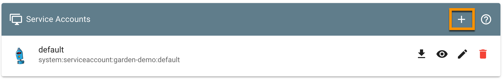
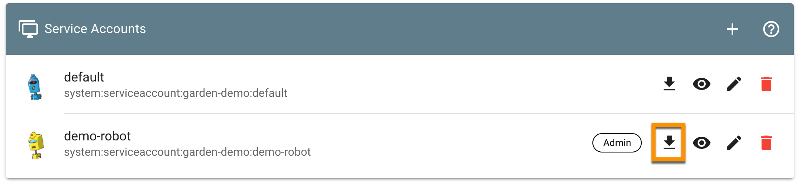

# Exercise 3.2 - The Garden Cluster
In this exercise you will create a technical user to access the Garden cluster and examine the shoot cluster you created earlier.

## Prerequisites
You have successfully completed the [previous exercise](./01_cluster_setup_yaml.md) resulting in a running cluster. Additionally, you need a [kubectl binary](https://kubernetes.io/docs/tasks/tools/install-kubectl/) for most steps of this exercise.

To start this exercise, open the Gardener dashboard and navigate to your project.

## Garden Cluster
"Gardener" consists of multiple layers. You already know the `shoot` cluster, which is where you would normally deploy your application / workloads to.

Another layer is the Garden cluster. The Garden cluster is an [extension API server](https://github.com/gardener/gardener/blob/master/docs/concepts/apiserver.md) and exposes various resources, like `Projects`, `Shoots`, `Seeds`, `CloudProfiles` etc. The Gardener Controller Manager acts upon it.
You already interacted with the Garden Cluster, when you created your project via the dashboard. Among other things this triggered the creation of a Kubernetes namespace. The project namespace is the context for all your actions like user management and shoot clusters to be described in.

Take a look at the [architecture overview](https://github.com/gardener/documentation/wiki/Architecture) for more information.

## Create a technical user
Gardener offers the creation of technical users on project level. Implemented as service accounts they are created in your project's namespace where all your shoot resources are kept. These service accounts can be equipped with the same set of permissions as any other project member, so they may be used to automate tasks like cluster creation or deletion.

For this exercise, start by creating a service account in your project. Therefore navigate to the *Members* section of your project.
<br>

At the bottom of the page, you will find a section called *Service Accounts*, which should be empty. Click the "+" button to start the creation dialog.
<br>

Give your service account a suitable name, assign the *admin* role and create it.
<br>

## Download the kubeconfig
Now that you have the service account, you need to obtain its credentials. In the previously empty section *Service Accounts* you should see the new user.
<br>

Go ahead, download the kubeconfig and store it in a suitable format and location so you can use it.

## Explore your project
Instead of using the Gardener dashboard, you are now going to explore the technical representation of these resources.

### Gardener resources overview
Firstly, list the Gardener core resources available in the Garden cluster:

```bash
kubectl api-resources --api-group=core.gardener.cloud
```

In the following steps, you are going to explore a few of them. Obviously, your service account, similar to any regular end-user, is not allowed to access all of them. If you want to learn more, please check the [API documentation](https://gardener.cloud/documentation/references/core/).

#### Shoots
Let's start with a resource you already encountered - the `shoot`.

```bash
kubectl get shoots
```

Similar to the information displayed in the Gardener dashboard, you will see the cluster's status. To view the full cluster specification and status, you can append the `-o yaml` flag to the previous command and run it again.

From all the details extract the `seedName` information to see onto which seed cluster your shoot has been assigned by the [Gardener-Scheduler](https://github.com/gardener/gardener/blob/master/docs/concepts/scheduler.md).

#### Seeds
The next resource to explore is the `seed`. This resource describes the environment where your shoot cluster's control-plane is deployed to. As you have seen in the previous exercise, a shoot cluster does not host its control-plane. These components are deployed to another cluster, called `seed`. Any existing Kubernetes cluster can be turned into a seed cluster, by using such a resource and granting Gardener access to it to deploy the necessary resources. The seed will host control-planes as its workload just as your shoot cluster will host your applications.

```bash
kubectl get seeds
```

Feel free to take a detailed look at one of the individual seed specification or check the [example on github](https://github.com/gardener/gardener/blob/master/example/50-seed.yaml) as well as the [documentation](https://gardener.cloud/documentation/guides/install_gardener/setup-seed/).

#### Cloudprofiles
In case you wondered how the dashboard was able to construct the cloud provider specific sections of your shoot resource - cloudprofiles are the resources to check. For each enabled provider there is cloudprofile available which specifies items such as the usable machine types, available regions and zones as well as the supported Kubernetes versions for this provider.

```bash
# get all available profiles
kubectl get cloudprofile
# explore a specific profile
kubectl get cloudprofile gcp -o yaml
```

Although the list would potentially allow quite a lot of different cluster configurations, only a few have been enabled for this workshop.

## Get your shoot's kubeconfig

The kubeconfig you downloaded before is used to connect to the Gardener API of the **garden**-cluster and to make changes in the namespace of your Gardener project. You cannot schedule any workload to the garden-cluster, the workload will go to the shoot-cluster.

To connect to the **shoot**-cluster, you will need its kubeconfig. This is stored inside a secret in the Garden cluster.

```shell
kubectl get secret
```

This will result in an output like this:

```console
NAME                     TYPE                                  DATA   AGE
default-token-ssbxl      kubernetes.io/service-account-token   3      15d
demo-robot-token-l2pcp   kubernetes.io/service-account-token   3      25h
uznp8bghg6.kubeconfig    Opaque                                3      25h
uznp8bghg6.monitoring    Opaque                                3      25h
uznp8bghg6.ssh-keypair   Opaque                                2      25h
```

Note the `uznp8bghg6.kubeconfig` secret (of course the name will be different for you as it includes the cluster's name) - this contains the kubeconfig of your shoot cluster. To extract the kubeconfig from it, use the following `-o jsonpath` argument to kubectl, pipe it through `base64 -d` and redirect it into a file:

**Linux/MacOS**
```shell
kubectl get secret uznp8bghg6.kubeconfig -o jsonpath='{.data.kubeconfig}' | base64 -d > shoot-kubeconfig.yaml
```

**Windows**
```shell
kubectl get secret uznp8bghg6.kubeconfig -o go-template='{{.data.kubeconfig | base64decode}}{{"\n"}}' > shoot-kubeconfig.yaml
```

## Summary
- You have created a service account in the Garden cluster using the Gardener dashboard
- Using kubectl, you have accessed the Garden cluster using this service account and listed Gardener specific API resources
- You have found and inspected your cluster represented by a `shoot` resource
- You have learned about `seed` and `cloudprofile` resources
- You have obtained the shoot's kubeconfig file.

## Up next
In the [next exercise](./03_edit_shoot.md) you will continue to use the service account's credentials to modify your shoot resource to trigger a change in your actual cluster.
