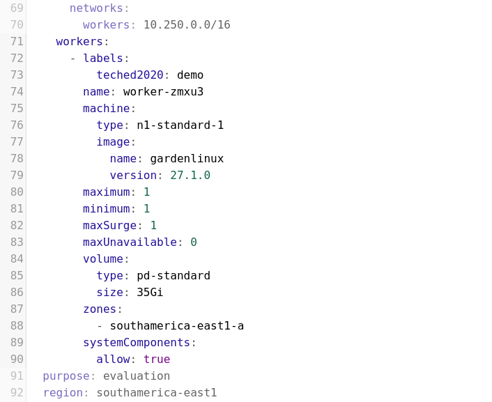
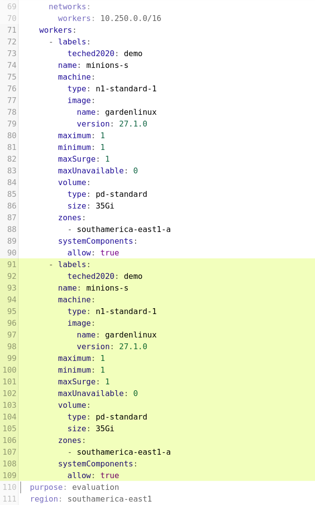
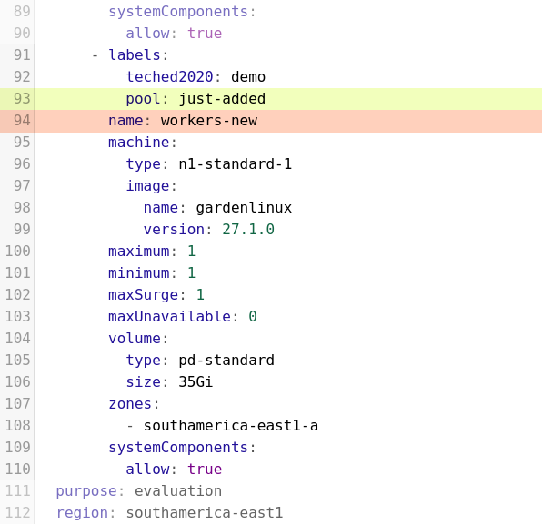
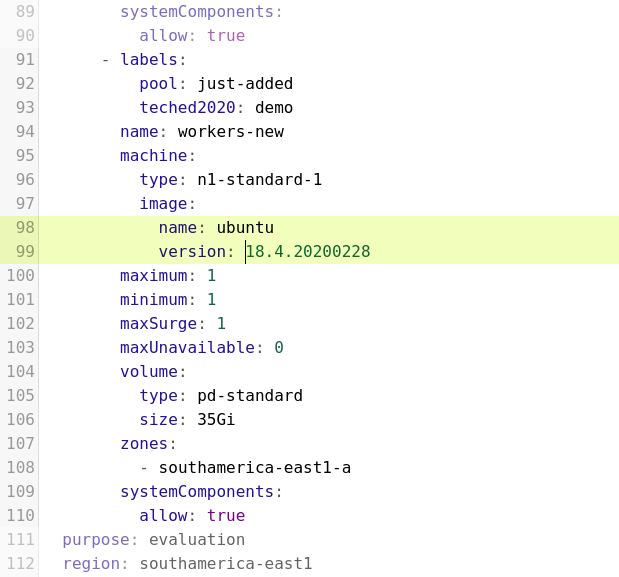
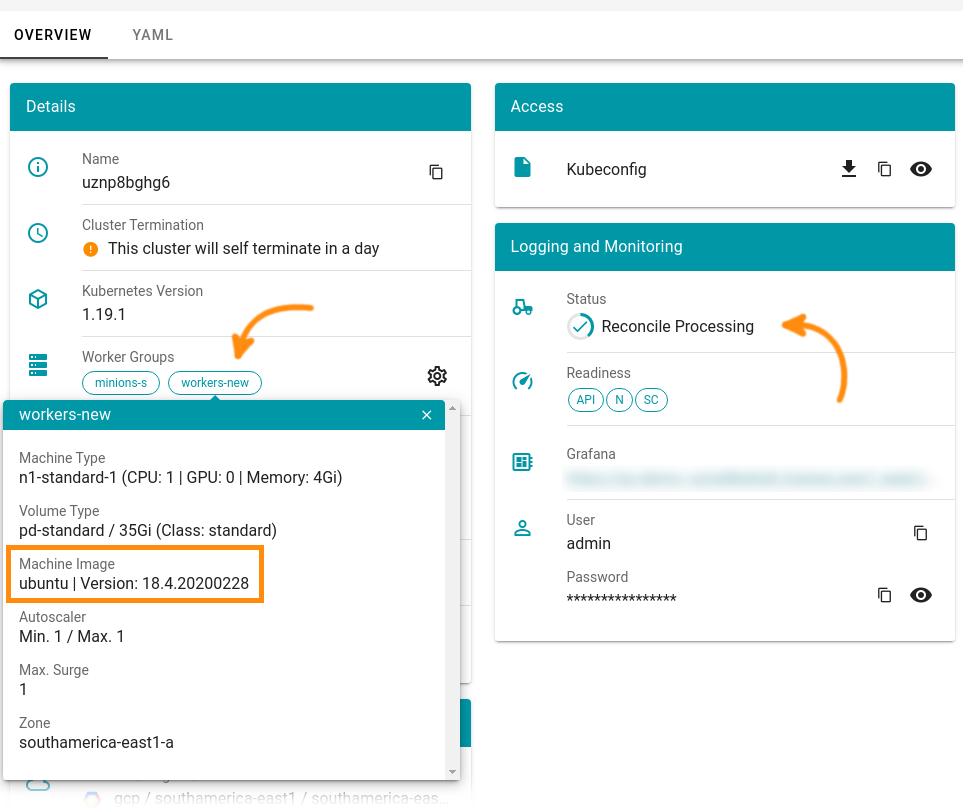

# Exercise 3.3 - Editing a shoot cluster through YAML

In this exercise you are going to edit an existing shoot cluster and add another pool of worker nodes to it, which will have custom properties.

## Prerequisites

- You have successfully created a shoot cluster either [via the UI](../ex2_advanced_ui/01_cluster_setup_ui.md) or [by using a YAML file](./01_cluster_setup_yaml.md).
- You have obtained and set up the **garden** cluster's kubeconfig file as described in the [previous exercise](./02_garden_cluster.md).

## Add a new worker pool to your cluster

Obtain the YAML representation of your shoot cluster with `kubectl`. First - in case you do not remember the name of your cluster - get the name of your shoot.

```shell
kubectl get shoot
```

You will receive an output like this:

```console
NAME         CLOUDPROFILE   VERSION   ...
uznp8bghg6   gcp            1.19.1    ...
```

To get the YAML file of your cluster, use `kubectl` and the cluster's name and redirect the output to the file `shoot.yaml`.

```shell
kubectl get shoot uznp8bghg6 -o yaml > shoot.yaml
```

Open the `shoot.yaml` file in your favorite editor.

### Locate the worker section in the YAML

Just like most Kubernetes resources, the shoot-YAML will consist of a `.metadata`, a `.spec` and a `.status` section. For this, you are only interested in the `.spec` section.

The workers of your shoot cluster are specified in the `.spec.provider.workers` section. You may have noticed that this element is a list containing one or more maps with each map specifying a worker pool.

<br>

### Copy & paste the worker pool

Copy and paste the whole worker pool to get a second worker pool.

<br>

### Adapt the names and labels

You now have two worker pools which are exactly identical - Gardener is not going to accept such a setup. Therefore, you will have to introduce some changes into your new worker pool.

Locate the `name:` element and give your new worker pool a unique name. Also you might want to attach another label to the workers of this pool.

<br>

### Use a different operating system for workers in this pool

Gardener comes with its own Linux distribution for the worker nodes, [gardenlinux](https://github.com/gardenlinux/gardenlinux). However, if you prefer your worker nodes to run on e.g. Ubuntu, you can tell Gardener to deploy that instead.

The new pool of worker nodes will run with Ubuntu. For that, locate the element `machine.image:`. Change the value of `name:` to **`ubuntu`** and the `version:` to **`18.4.20200228`**.

**Note:** you need to use the version string `18.4.20200228`, other versions are not supported in this demo environment.

<br>

### Save and apply your changes

Save your changes to the YAML file and exit your editor.

Use `kubectl` to apply your changes.

```bash
kubectl apply -f shoot.yaml
```

**Note:** You might face an error message similar to this one: `Operation cannot be fulfilled on shoots.core.gardener.cloud: the object has been modified; please apply your changes to the latest version and try again`

In this case please remove the `resourceVersion` field from the `metadata` section of you shoot.yaml and retry to apply the changes.

### Observe the reconciliation

Change back to the overview page. Now that you introduced changes into the cluster configuration, a reconcilation process will take place which is displayed to you in the _Status_ field.

Once the reconciliation loop has successfully finished (which may take some time, Gardener has to deploy new virtual machines to GCP after all), you will notice a new worker group with the custom name you chose before. Once you click on it, you will get detailed information about the workers - including the operating system image they are running.

<br>

## Summary

- You have successfully modified the cluster configuration through its YAML representation.

## Up next
In the [next exercise](./04_controllers_at_work.md) you will observe how Gardener keeps the cluster in good shape at all times.
