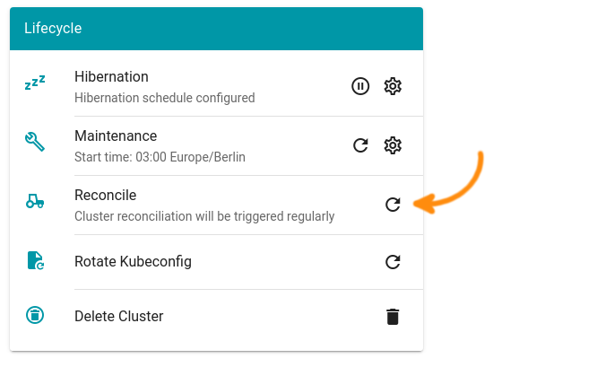

# Exercise 3.4 - Gardener's controllers at work

In this exercise you are going to observe how gardener keeps your cluster up and running.

## Prerequisites

- You have successfully created a shoot cluster and added a second worker pool as described in the [previous exercise](./03_edit_shoot.md).
- You have obtained and set up the **garden** cluster's kubeconfig file as described in the [exercise 2](./02_garden_cluster.md).

## Delete a node...

Use the **shoot** cluster kubeconfig file and get the list of nodes.

```shell
kubectl get nodes
```

If you have followed all the steps of the previous exercise, you will get a list of two nodes.

```console
NAME                                                      STATUS   ROLES    AGE     VERSION
shoot--demo--uznp8bghg6-minions-s-z1-7585dd9b4-84ck5      Ready    <none>   7m55s   v1.19.1
shoot--demo--uznp8bghg6-workers-new-z1-7bcf7f57b5-mpjkh   Ready    <none>   6m51s   v1.19.1
```

Now, just pick one of the two nodes and delete it:

```shell
kubectl delete node shoot--demo--uznp8bghg6-minions-s-z1-7585dd9b4-84ck5
```

## ... and observe how it reappears

**Note:** This can take some time as Gardener's worker node reconcilation only takes place after certain grace periods have passed. As you might not want to wait that long, please log on to the Gardener dashboard again and select your cluster's overview page.

Hit the _Reconcile_ button and confirm with _Trigger now_.

<br>

While the cluster reconciles, repeatedly query the nodes in the cluster with `kubectl get nodes`. Eventually you will see a new node appearing.

## Summary

- You have observed how Gardener's controllers reconcile the cluster.
